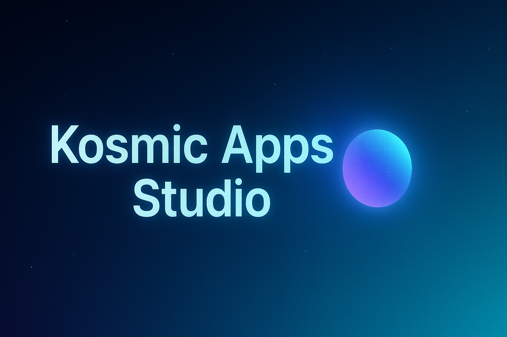
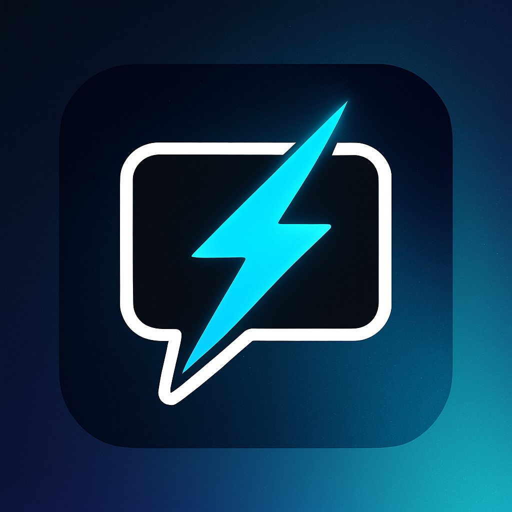
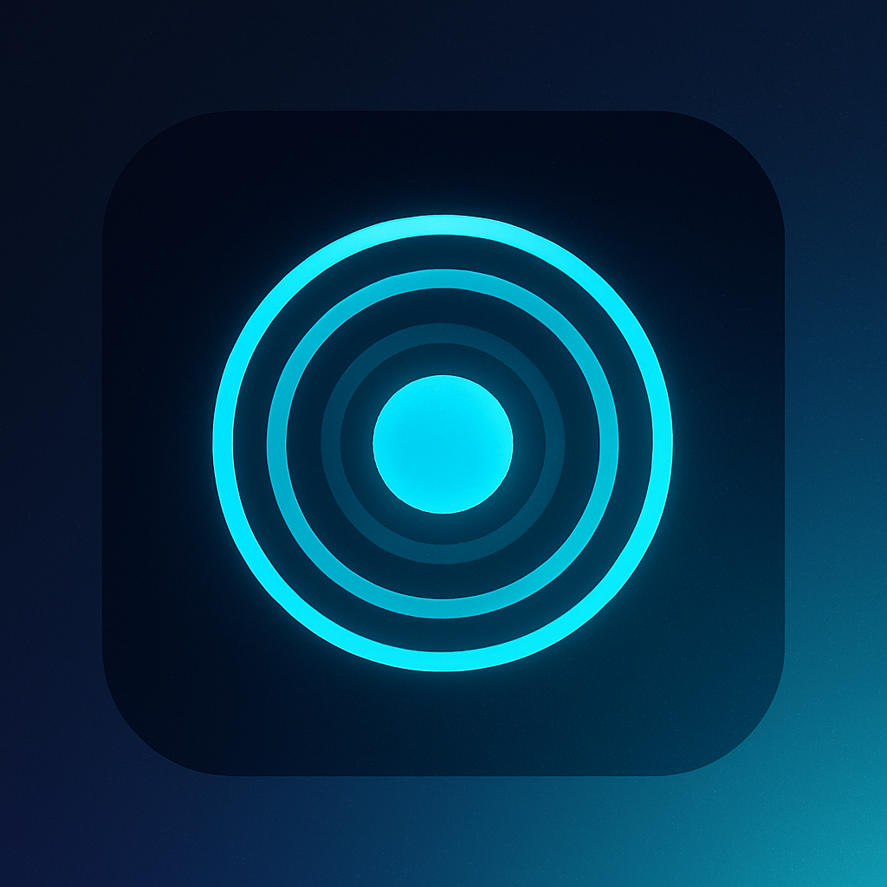
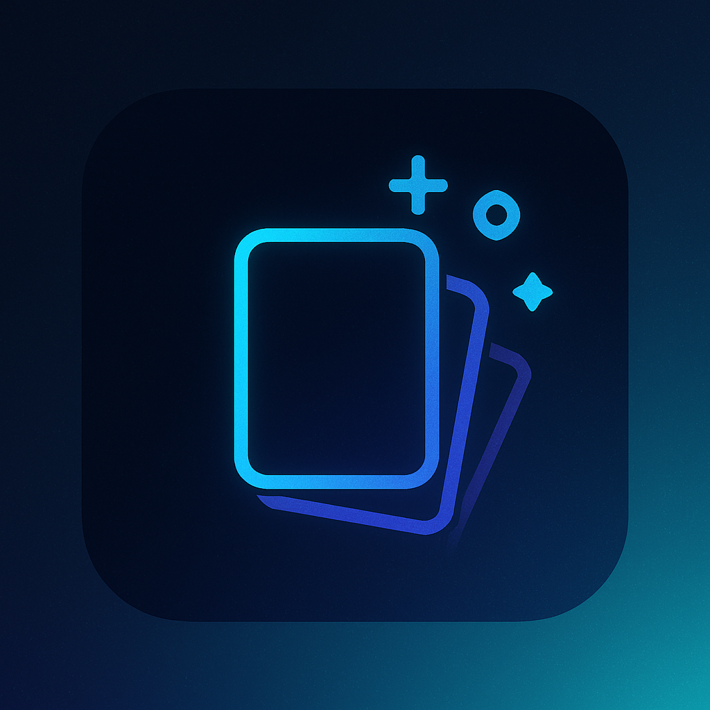
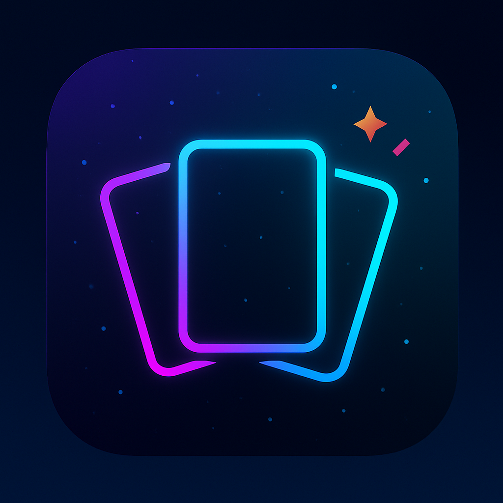

  

  
  
  
  
  
  

---

# 🌌 Kosmic Apps Studio  

**We’re not just building apps — we’re building a movement.**  
One founder, powered by a full AI-driven team. Lean, fast, and playful. Viral-ready ideas turned into living, breathing tools.  

---

## 🎨 App Lineup  

  
  
  
  
  

---

## 🚀 Current Projects  

- **StreakyBot** – A chat-first productivity companion with reminders, badges, and streaks.  
- **Cosmic Breathe** – 30–60 second breathing resets with haptics and cosmic visuals.  
- **Stoic Cards** – A daily discipline deck to sharpen focus and mindset.  
- **DeckPal** – Speak or type your idea → instantly get 3 polished “cards” (pitch, plan, hook).  
- **Creative Journal (working title)** – An adaptive AI journaling coach that evolves with your mood and themes.  

---

## 🌌 The Kosmic Story  

Born out of frustration with bloated SaaS projects, Kosmic Apps found clarity: **small, sharp apps beat endless platforms**.  
149 hours of dead-end complexity became the tuition for a breakthrough — apps are where creativity lives.  
Now, we build fast, test instantly, and refine endlessly — guided by AI agents and a bold, cosmic vision.  

---

## 🪐 Philosophy  

Every app follows the **1+1+1 Law**:  
- **Core Hook** → The one reason you open it.  
- **Supportive Feature** → The piece that reinforces the habit.  
- **Delight Touch** → The spark that makes it unforgettable.  

---

## ✦ Core Values  

🔥 **Lean First** – Scope with the 1+1+1 rule. No bloat. No waste.  
⚡ **Viral by Design** – If it isn’t shareable in 5 seconds, rethink it.  
🎨 **Bold & Playful** – Cosmic, colorful, unapologetically fun.  
📊 **Market-Driven Monetization** – Free, One-Time, Subscription, Hybrid — whatever works.  
🚀 **Risk-Free Creativity** – Build fast, cut fast, move on.  

**These aren’t just principles — they’re the DNA of Kosmic.**  

---

## ⚙️ Tech Stack  

- **React Native** – Cross-platform core for iOS builds.  
- **TailwindCSS** – Utility-first styling for speed and consistency.  
- **Gemini AI** – Adaptive intelligence powering journaling and creativity.  
- **Cursor IDE** – AI-driven environment that accelerates development.  
- **GitHub** – Version control and collaborative backbone.  

---

## 🌠 Road Ahead  

This is just the beginning. Year 1: launch 7 apps across categories. Year 5: a full-time studio, lean and limitless.  

Kosmic is not here to compete. Kosmic is here to redefine.  

---

## 🤝 Contributing & Issues  

Kosmic Apps is currently independent and in active development.  
- 💡 Have an idea? Open an issue.  
- ⭐ Like what you see? Star this repo to follow along.  
- 🛠️ Contributions are welcome in the form of feedback, testing, and creative collaboration.  

---

✨ *Kosmic Apps isn’t just about apps — it’s about building a new way to create. Cosmic, bold, and human-first.*  
